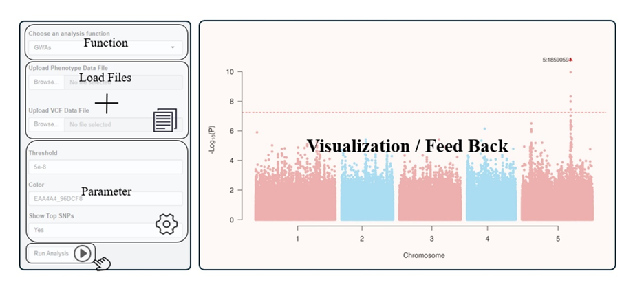
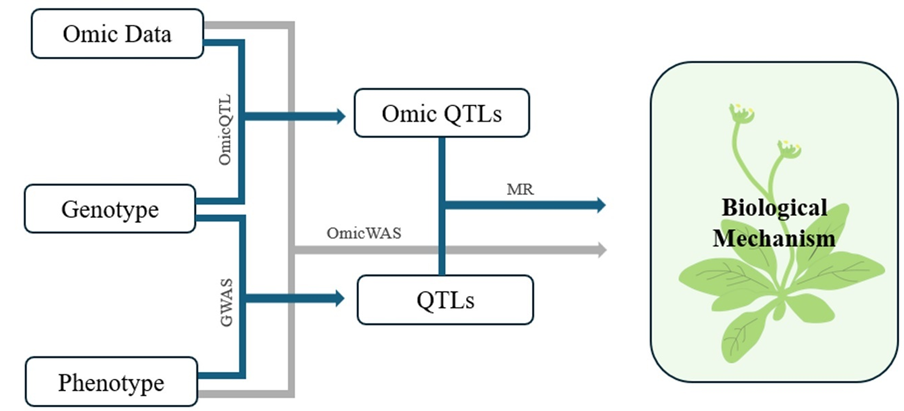

# ODIG
A graphical user interface for omics data integrated GWAS  

| | |
| --- | --- |
| Author  | Yu Han ([yuhan](https://www.researchgate.net/profile/Yu-Han-165)) |
| Email   | <yu_han@stu.scu.edu.cn> |

## Description
ODIG is an R Shiny application with a graphic user interface (GUI) application that integrates the Omic data for GWAS analysis. 
And it is a user-friendly application that allows users to perform association analysis locally without any coding.

|Function|Description|
| ----------- | ----------- |
|[Data Matching](#1)|Preparing input files for subsequent analysis. |
|[Phenotype Analysis](#2)|Providing critical insights into the input data characteristics and facilitates the detection of outlier values.|
|[GWAS](#3)|Testing the significance of associations between each SNP and the phenotype using a linear mixed model|
|[COJO](#4)|Reanalysing results from the GWAS function and identify secondary association signals|
|[Locus Zoom](#5)|Displaying the significance, linkage, and nearby genes of SNPs in specific chromosome regions|
|[Omic QTL](#6)|Employing linear models for association analysis of omics data and genotype data|
|[Two Traits MR](#7)|Exploring causal relationships between two traits|
|[SMR](#8)|Exploring causal relationships between trait and molecular trait|
|[OmicWAS](#9)|Testing the associations between omic data and complex traits|
---
## Software Installation
### Docker installation
### ODIG installation
### Start
---
## Panel and workflow
The sidebar contains a select list to choose the analysis function, a file upload control to upload files required for different analyses, a parameter control to adjust the parameters before analysis, and an action button to perform the analysis. The main area occupies most of the horizontal width in the application window and contains visualized outputs and feedback

GWAs function can perform association analysis between genotype and phenotype and find QTLs with significant association. OmicQTL function treats omic data as molecular phenotype and tests the association with genotypic data. MR function integrates the QTLs and OmicQTLs to find causal variants. OmicWAS tests the association between phenotypic and omics data.

---
## Software Usage
### <h3 id="1">Data Matching</h3>
#### Input Files
#### Parameter
#### Analysis Process
#### Output Results
---
### <h3 id="2">Phenotype Analysis</h3>
#### Input Files
#### Parameter
#### Analysis Process
#### Output Results
---
### <h3 id="3">GWAS</h3>
#### Input Files
#### Parameter
#### Analysis Process
#### Output Results
---
### <h3 id="4">COJO</h3>
#### Input Files
#### Parameter
#### Analysis Process
#### Output Results
---
### <h3 id="5">Locus Zoom</h3>
#### Input Files
#### Parameter
#### Analysis Process
#### Output Results
---
### <h3 id="6">Omic QTL</h3>
#### Input Files
#### Parameter
#### Analysis Process
#### Output Results
---
### <h3 id="7">Two Traits MR</h3>
#### Input Files
#### Parameter
#### Analysis Process
#### Output Results
---
### <h3 id="8">SMR</h3>
#### Input Files
#### Parameter
#### Analysis Process
#### Output Results
---
### <h3 id="9">OmicWAS</h3>
#### Input Files
#### Parameter
#### Analysis Process
#### Output Results
---

