# EasyOmics
A graphical user interface for omics data integrated GWAS  

| | |
| --- | --- |
| Author  | Yu Han ([yuhan](https://www.researchgate.net/profile/Yu-Han-165)) |
| Email   | <yu_han@stu.scu.edu.cn> |


## Description
EasyOmics is an R Shiny application with a graphic user interface (GUI) application that integrates the Omic data for GWAS analysis. 
And it is a user-friendly application that allows users to perform association analysis locally without any coding.

|Function|Description|
| ----------- | ----------- |
|[Data Matching](#1)|Preparing input files for subsequent analysis. |
|[Phenotype Analysis](#2)|Providing critical insights into the input data characteristics and facilitates the detection of outlier values.|
|[GWAS](#3)|Testing the significance of associations between each SNP and the phenotype using a linear mixed model|
|[COJO](#4)|Reanalysing results from the GWAS function and identify secondary association signals|
|[Locus Zoom](#5)|Displaying the significance, linkage, and nearby genes of SNPs in specific chromosome regions|
|[Omic QTL](#6)|Employing linear models for association analysis of omics data and genotype data|
|[Two Traits MR](#7)|Exploring causal relationships between two traits|
|[SMR](#8)|Exploring causal relationships between trait and molecular trait|
|[OmicWAS](#9)|Testing the associations between omic data and complex traits|

---
## Software Installation
### Docker installation
Docker is an open-source project developed in Go language, which could package software and its dependencies into images for quick deployment environment.

For Windows/Mac OS users, please visit Docker's official website to download the Docker Desktop application: https://docs.docker.com/get-docker/

Note, Windows users need refer to Microsoft's documentation to download and set up the WSL2 subsystem after insatlled docker: https://docs.microsoft.com/en-us/windows/wsl/install
### EasyOmics installation
After installing docker users need following these steps:
- Open the Docker Desktop application.
- Search for yuhan2000 and pull (download) the image yuhan2000/gwas:latest

<div align=center>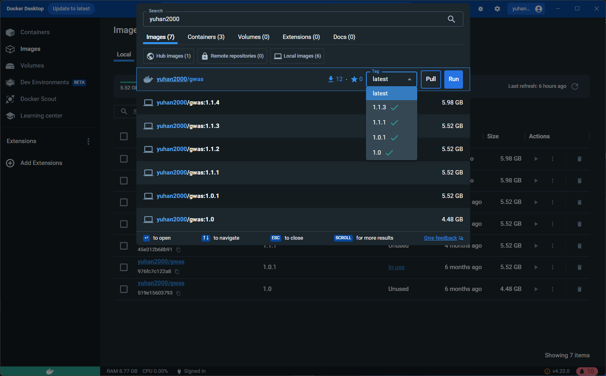</div>

### Start
- Click to run buttom to creat a container of downloaded figures/image.

<div align=center>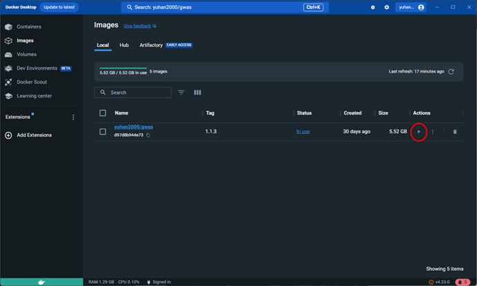</div>

- Set the container parameters. 
  - Container name could be any characters.
  - Host port could be 0 or any other four digits
  - Directory :
    - Host path is the local empty directory path to save analysis result
    - Container path must be "/srv/shiny-server/Result/"port for output results.
  - Environment varables don't need setting

<div align=center>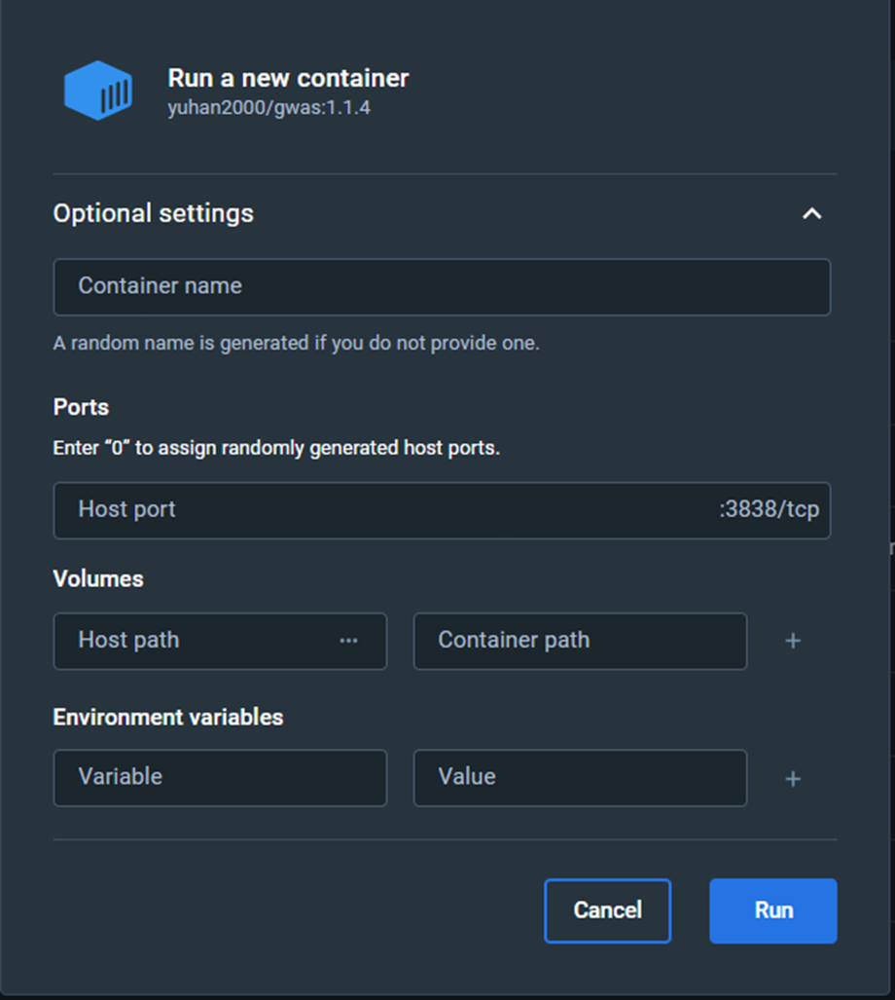</div>

- Enter "localhost:port" (eg. localhost:3838) in the browser's address bar to enter the software interactive interface
- Click the stop button in the container tab to exit the software.
---
## Panel and workflow
The sidebar contains a select list to choose the analysis function, a file upload control to upload files required for different analyses, a parameter control to adjust the parameters before analysis, and an action button to perform the analysis. The main area occupies most of the horizontal width in the application window and contains visualized outputs and feedback

<div align=center>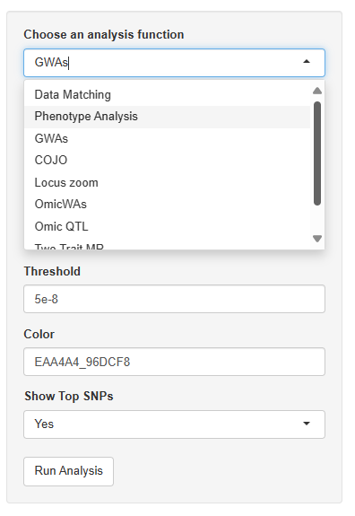</div>


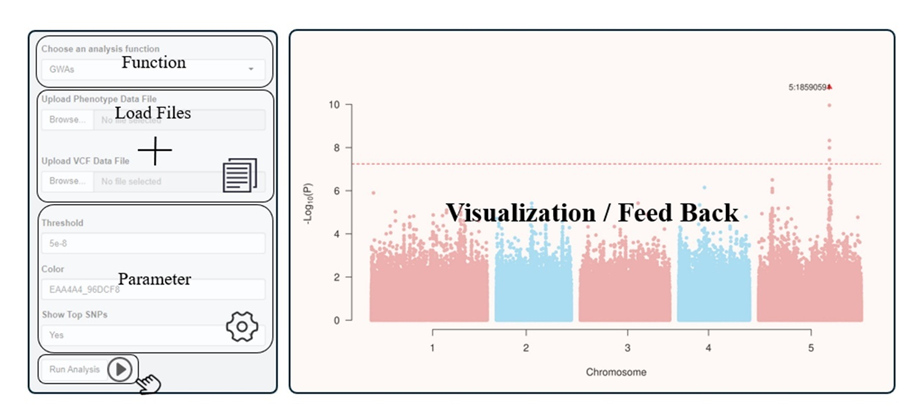

GWAs function can perform association analysis between genotype and phenotype and find QTLs with significant association. OmicQTL function treats omic data as molecular phenotype and tests the association with genotypic data. MR function integrates the QTLs and OmicQTLs to find causal variants. OmicWAS tests the association between phenotypic and omics data.

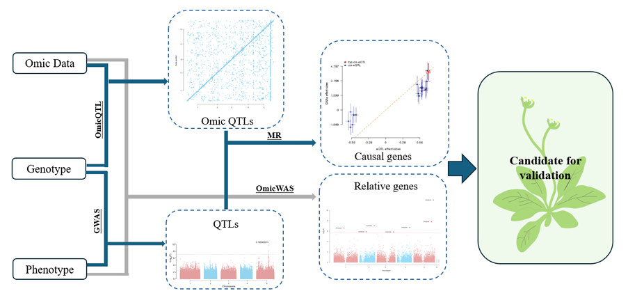

---
## Software Usage
### <h3 id="1">Data Matching</h3>
#### Input Files
- Text files split by "tab", containing at least three columns: family code, individual code, and phenotypic value of the trait (supports multiple phenotypes).
```txt
family id FT16
108 108 52.25
139 139 52.75
159 159 56.75
265 265 47.25
350 350 51.5
351 351 65.33333333
403 403 54.25
410 410 65.25
424 424 68.25
```
- Standard VCF format genotype file, where the individual code must follow the format "family code_individual code".
```txt
#CHROM  POS     ID      REF     ALT     QUAL    FILTER  INFO    FORMAT  108_108 139_139
1       73      1:73    C       A       .       .       PR      GT      0/0     0/0
1       92      1:92    A       C       .       .       PR      GT      1/1     1/1
1       110     1:110   G       T       .       .       PR      GT      0/0     0/0
1       253     1:253   T       C       .       .       PR      GT      0/0     0/0
1       353     1:353   G       A       .       .       PR      GT      0/0     0/0
1       363     1:363   C       G       .       .       PR      GT      1/1     1/1
1       425     1:425   C       T       .       .       PR      GT      0/0     0/0
1       502     1:502   T       C       .       .       PR      GT      0/0     0/0
1       508     1:508   C       T       .       .       PR      GT      0/0     0/0
```

#### Parameter
None.
#### Analysis Process
Extract individual codes from phenotype and variant call format (VCF) files, excluding individuals lacking phenotype or genotype data. Then, Plink was used to filter the VCF file for minor allele frequency greater than 0.03 and pairwise r2 smaller than 0.99.
#### Output Results
Output the processed VCF file and phenotype file to the directory bound when running the software, adding the prefix "Matched_" to the file name to remind users. All subsequent analyses are based on the files generated by this function.

---
### <h3 id="2">Phenotype Analysis</h3>
#### Input Files
- Phenotype file output from the "Data Matching" function.

- VCF file output from the "Data Matching" function.
#### Parameter
- Analysis type: Select the method of analyzing the phenotype file, including options for multiple traits and single traits.
#### Analysis Process
For multi-trait analyses, EasyOmics calculates the distribution of phenotypes, phenotypic variance, genetic variance, and narrow-sense heritability using the AI-REML method. 

For single trait EasyOmics presents the phenotype distribution in a density plot and visualizes population structure through PCA analysis of SNP data in a scatter plot, annotating each point with its corresponding ID. 
#### Output Results
- Multi-trait analysis results, with different colors distinguishing the results of different traits. 

<div align=center>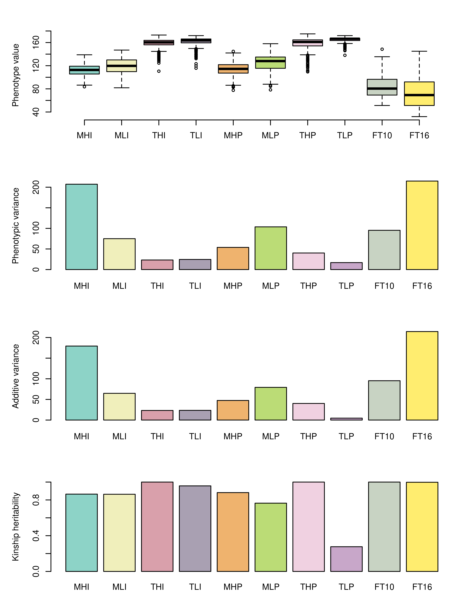</div>

- For single-trait analysis, the results display phenotype distribution in a density gradient format with marked individual codes, assisting users in inspecting unreasonable phenotypic data. The genetic structure, shown in a two-dimensional principal component analysis along with marked individual codes, helps users check the genetic composition of the analyzed population. 

<div align=center>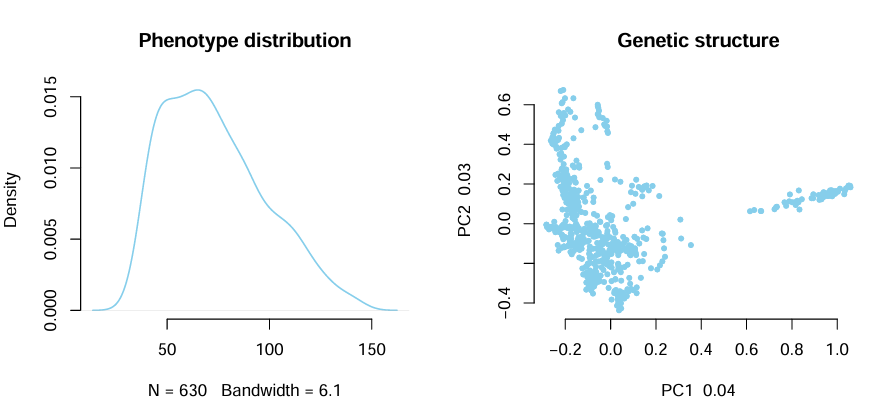</div>

- Result of invoked softwares.

---
### <h3 id="3">GWAS</h3>
#### Input Files
- Phenotype file output by the "Data Matching" feature.

- VCF file output by the "Data Matching" feature.
#### Parameter
- Threshold: A value setting the significance threshold (P-value) for GWAs analysis. SNPs with P-values below this threshold are retained. Supports numeric input, defaulting to 5e-8. For users unsure of the 
significance threshold, entering "Bonferroni" sets it to 0.05 divided by the number of SNPs.

- Color: Sets adjacent chromosome colors in the Manhattan plot 
visualization, requiring two hexadecimal colors connected by an underscore.

- Show Top SNPs: Option to annotate the ID of the most significant SNPs in the Manhattan plot.

#### Analysis Process
The software uses GCTA to conduct a mixed linear model association analysis for each SNP and phenotype. If the inflation factor is bigger than 1.1, lambda adjusted p value will be used. If "Show Top SNPs" is selected, EasyOmics extracts and merges SNPs based on their significance, physical distance, and Linkage Disequilibrium (LD),  and annotates the most significant independent SNPs on the Manhattan plot.
#### Output Results
- Manhattan plot
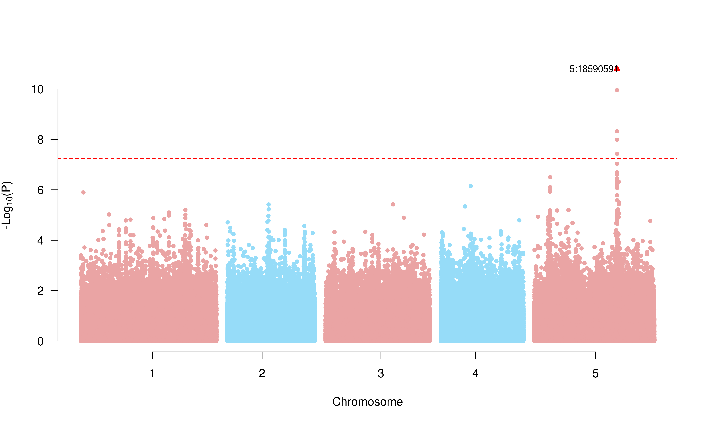
- QQ plot


<div align=center>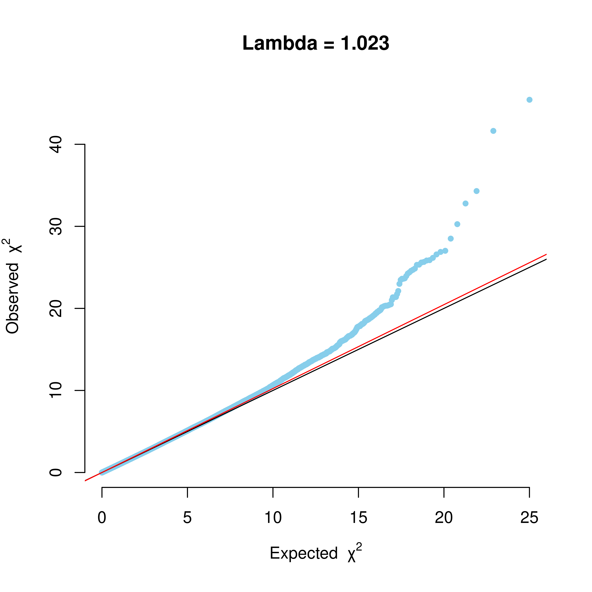</div>

- Text file containing information on the most significant independent SNPs.
  
```txt
    CHR SNP POS A1 A2 AF1 BETA SE P N
    5 5:18590591 120291299.92 T C 0.0793651 10.331 1.5328 1.58423e-11 630
```
- Association analysis result files.
  
```txt
Chr SNP bp A1 A2 Freq b se p N
1 1:73 73 A C 0.068254 1.10844 1.36156 0.41559 630
1 1:92 92 C A 0.426984 -1.2514 0.831731 0.132435 630
1 1:110 110 T G 0.0984127 0.660525 1.40149 0.637425 630
1 1:253 253 C T 0.134921 0.366683 1.23615 0.766747 630
1 1:353 353 A G 0.11746 -2.05469 1.44436 0.154862 630
1 1:363 363 G C 0.0904762 -0.615237 1.36211 0.651501 630
1 1:425 425 T C 0.155556 0.00264974 1.19871 0.998236 630
1 1:502 502 C T 0.342857 -0.134289 0.922746 0.884291 630
```
- Result of invoked softwares.
---
### <h3 id="4">COJO</h3>
#### Input Files
- Result file from "GWAs."
- The same VCF file input in "GWAs."
#### Parameter
Same as "GWAS".
#### Analysis Process
Utilizes GCTA software COJO function to remove significant SNPs in the "GWAs" analysis and analyze whether any SNPs are still significant.
#### Output Results
Same as "GWAS".

---
### <h3 id="5">Locus Zoom</h3>
#### Input Files
- VCF file used in "GWAs" analysis.
- Standard GFF3 file annotating gene positions on the reference genome.
- Association analysis result file from "GWAs."
- The phenotype file used in "GWAs" analysis.

#### Parameter
- SNP ID：Select the ID of the SNP to display.
- Region：Choose to display other SNPs in the vicinity of the selected SNP.

#### Analysis Process
The software uses LDBlockShow to calculate linkage disequilibrium between the selected SNP and other nearby SNPs, displaying this in conjunction with association analysis results and gene locations. 

It also analyzes and plots phenotypes of individuals with different genotypes of the selected SNP, aiding users to check the effect of the SNP on traits. 

#### Output Results
- Visualization of results including linkage and P-values of the selected SNP and other SNPs; genes in the interval; linkage between all SNPs in the interval. 

- Phenotypes of individuals with different genotypes of the selected SNP

<div align=center>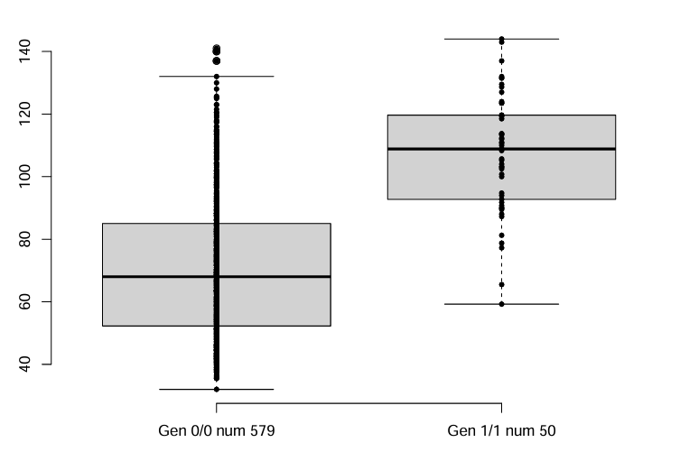</div>

- Result of invoked softwares.
 
---
### <h3 id="6">Omic QTL</h3>
#### Input Files
- Gene expression file with the first two columns consistent with the phenotype file format and each subsequent column representing the expression level of each gene or omic data value of each probe. 
- Standard GFF3 file annotating gene positions on the reference genome. If the omics data is other types, a file with a format similar to GFF3 needs to be input to identify the location of the probe on the chromosome.
- Standard VCF file consistent with previous genotype files.

#### Parameter
Select Omic Type: Choose the type of omics data, including transcriptome, methylome, and others. Different types of omics data use different analysis processes.
Normalization Data: Choose whether to normalize omics data to prevent the effect caused by data scale in association analysis.
Threshold: Same as "GWAs."

#### Analysis Process
EasyOmics first uses Plink for principal component analysis of population structure, then uses the top 20 principal components as covariates for parallel linear model-based association analysis of each omics data and genotype data. Then calculates the chromosomal positions of SNPs and molecular traits based on user input in file displays them. 
#### Output Results
- Scatter plot of genes or probes and their QTL positions on chromosomes.

<div align=center>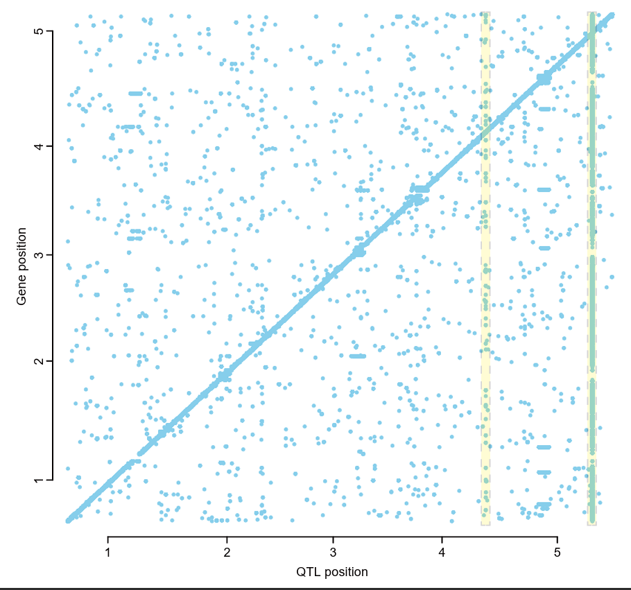</div>

- Text file containing association results of all SNPs.
  
```txt
SNP gene beta t-stat p-value FDR
1:19461508 AT1G52270 0.674590385651332 28.123511975575 4.14591267172224e-112 2.02150807617404e-102
1:19462038 AT1G52270 0.674590385651332 28.123511975575 4.14591267172224e-112 2.02150807617404e-102
1:19462623 AT1G52270 0.673281447249011 27.9516480473353 3.39978031137861e-111 8.28850472845873e-102
1:19462886 AT1G52270 0.673281447249011 27.9516480473353 3.39978031137861e-111 8.28850472845873e-102
1:19463170 AT1G52270 0.671582251314867 27.9031631086884 6.15721634281558e-111 1.20088034160951e-101
```
- Frequency of SNPs located in different molecular traits.
  
```txt
Prob freq
AT1G52270 4
AT1G23935 3
AT1G12340 3
AT2G05140 3
```
- Frequency of significant associated traits in each leading SNPs.
  
```txt
QTL freq
1:10021441 1
1:10023611 1
1:10024590 1
1:10025607 1
```
- Result of invoked softwares.

---
### <h3 id="7">Two Traits MR</h3>
#### Input Files
- Association analysis result file generated in "GWAs."
- Association analysis result file generated in "GWAs" analysis for traits different from file one.
- CF file all SNPs in file one and two.

#### Parameter
Threshold：Same as "GWAs."
#### Analysis Process
Uses GCTA software's Mendelian randomization function to analyze whether the instrumental variable SNP affects trait in file one through the trait in file two, thus determining the causal relationship between the two traits. 
#### Output Results
- Correlation of effect values of SNPs passing the threshold on the two traits. 

<div align=center>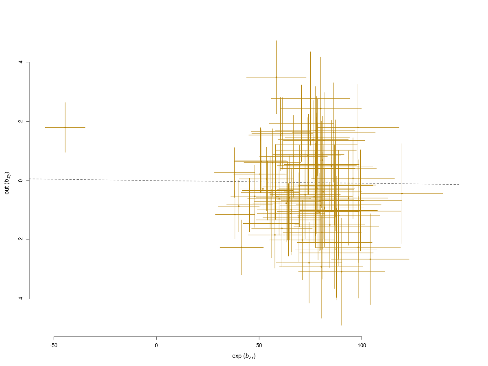</div>

- Result of invoked softwares.

---
### <h3 id="8">SMR</h3>
#### Input Files
- File from "Omic QTL" containing association results of all SNPs. 
- Association analysis result from "GWAs."
- Standard VCF file containing all SNPs from files one and two.
- Consistent GFF3 file from "Omic QTL."

#### Parameter
Threshold：Same as "GWAs."
#### Analysis Process
Uses SMR software to analyze whether the instrumental variable SNP affects the trait through the molecular trait, conducting parallel analysis for each molecular trait. 
#### Output Results
-  Prioritizing genes at a GWAS locus using SMR analysis. Shown are results at Omic data loci for phenotype. Top plot is the P values for SNPs from GWAs. Middle plot is the P values for SNPs from omicQTL. Bottom plot is the gene position in the selected region.
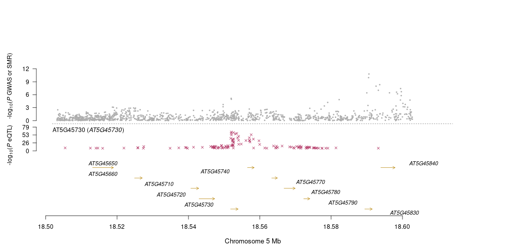
- Scatter plot of detected SNP effect on Omic data and phenotype.

<div align=center>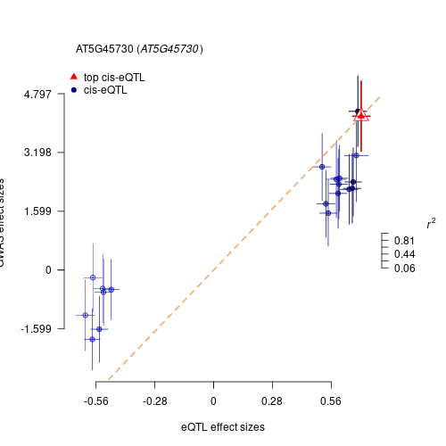</div>

- Result of invoked softwares.

---
### <h3 id="9">OmicWAS</h3>
#### Input Files
- Phenotype file processed by "Data Matching" or another phenotype file with a consistent format.
- Gene expression file with the first two columns consistent with the phenotype file format and each subsequent column representing the expression level of each gene or omic data value of each probe. 
- Standard GFF3 file annotating gene positions on the reference genome.

#### Parameter
Same as "GWAS".
#### Analysis Process
Using a mixed linear model-based omic association (MOA) approach implemented in OSCA to test for associations between omic data and complex traits
#### Output Results
- Manhattan plot visualizing the association analysis result file.

- Information about the most significant genes saved in the form of text files.
```txt
CHR GENE POS BETA SE P
1 AT1G35180 12877971 -6.01368 1.16958 2.72189e-07
2 AT2G20440 41629997.1 -5.45747 1.12895 1.33733e-06
2 AT2G45660 51627142.1 -5.61117 1.05067 9.26555e-08
```
- Result files of association analysis.
```txt
Chr	Probe	bp	Gene	Orientation	b	se	p
NA	AT1G01010	-9	NA	NA	1.85785	1.30401	0.154237
NA	AT1G01020	-9	NA	NA	2.33586	1.20758	0.053071
NA	AT1G01030	-9	NA	NA	0.20638	1.15516	0.858206
NA	AT1G01040	-9	NA	NA	0.0696289	0.990418	0.943953
NA	AT1G01050	-9	NA	NA	2.54477	1.49342	0.0883824
```
- Result of invoked softwares.
  
---


